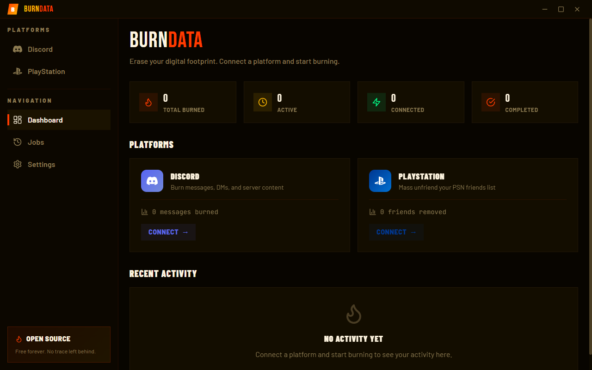
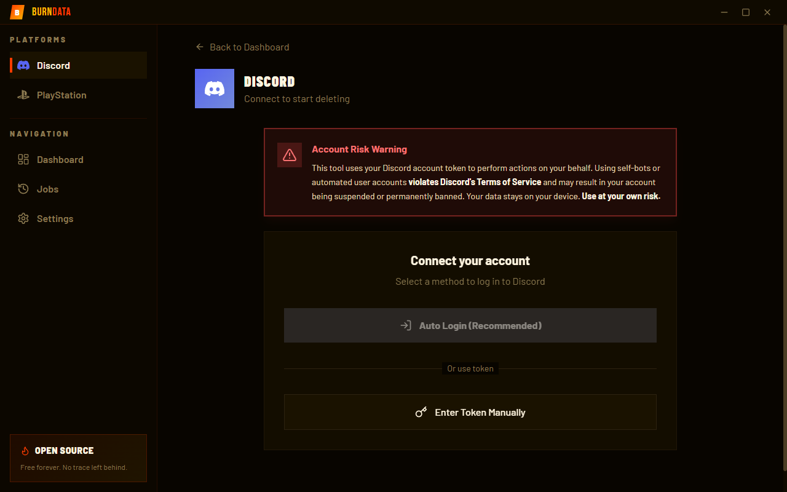
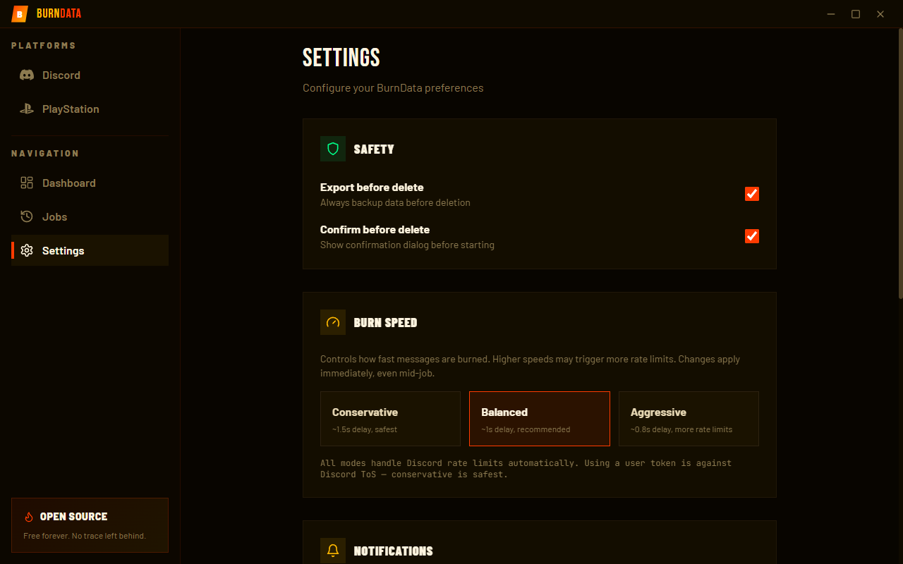

<p align="center">
  
</p>

<h1 align="center">BurnData</h1>

<p align="center">
  <b>Erase your digital footprint.</b>
</p>

<p align="center">
  
  
  
  
</p>

<br>

<p align="center">
  
</p>

---

## What is BurnData?

BurnData lets you mass-delete your data from platforms like Discord and PlayStation Network. No cloud, no subscriptions — everything runs locally on your machine.

- **Discord** — delete messages across DMs and servers, with date filters and data package import
- **PlayStation** — mass unfriend your PSN friends list

## Screenshots

<p align="center">
  
  &nbsp;&nbsp;
  
</p>

## Features

- **100% local** — your tokens are encrypted and never leave your device
- **Smart rate limiting** — adaptive delays, burst+pause strategy, handles 429s automatically
- **Data package import** — load your Discord data export (ZIP) for faster targeted deletion
- **Export before delete** — backup everything before burning
- **Job queue** — queue multiple deletions, pause/resume anytime
- **Real-time progress** — live stats, ETA, per-channel tracking
- **Headless CLI** — run on a server (Debian/Ubuntu) with Discord webhook notifications

## Download

Grab the latest installer from [**Releases**](https://github.com/NobodyHeree/BurnData/releases).

> Windows only for now. macOS/Linux coming later.

## Build from source

```bash
git clone https://github.com/NobodyHeree/BurnData.git
cd DeleteData
pnpm install
pnpm dev
```

Requires Node.js 20+ and pnpm 10+.

## How it works

1. Connect your account (auto-login or manual token)
2. Select what to delete — servers, DMs, date range
3. Optionally import your Discord data package for faster scanning
4. Hit delete and watch it burn

> **Heads up:** Using a user token is against Discord's ToS. This can get your account banned. Your call.

## Tech stack

Electron + React + Vite + TypeScript + Tailwind + Zustand. Monorepo with pnpm workspaces.

```
apps/desktop    Electron app
apps/cli        Headless CLI for servers
packages/core   Types, engine interfaces
packages/services   Discord & PSN API clients
packages/ui     Shared components
```

## Disclaimer

This tool is provided as-is for educational and personal use. Using automated tools or user tokens may violate platform Terms of Service. The authors are not responsible for account suspensions, bans, or data loss. **Use at your own risk.**

## License

MIT
